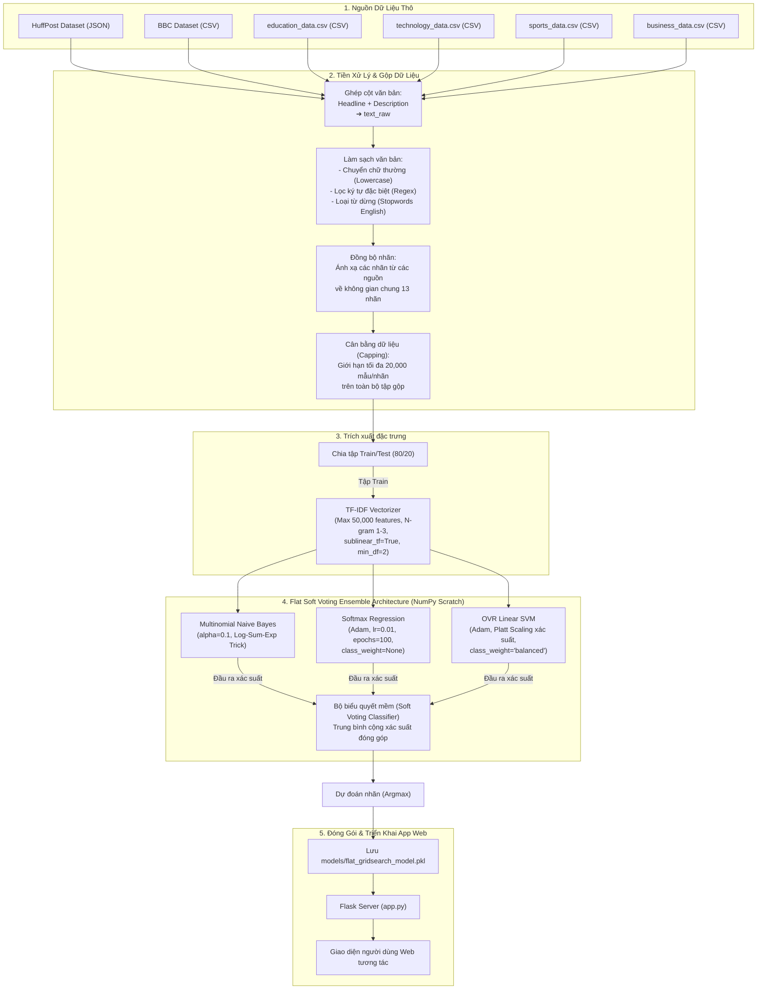

# BÁO CÁO DỰ ÁN: PHÂN LOẠI TIN TỨC VỚI KIẾN TRÚC FLAT SOFT VOTING ENSEMBLE

## TÓM TẮT DỰ ÁN
Bài toán phân loại văn bản tự động là một nhánh nghiên cứu nền tảng và quan trọng trong lĩnh vực Xử lý Ngôn ngữ Tự nhiên (NLP) và Trí tuệ Nhân tạo. Trong các bài toán thực tế như phân loại luồng tin tức báo chí điện tử, dữ liệu đầu vào thường có độ dài cực ngắn (chỉ gồm Tiêu đề và Mô tả ngắn) dẫn đến không gian đặc trưng thưa thớt (sparsity) và đối mặt với sự mất cân bằng lớp cực đoan (class imbalance). 

Để giải quyết bài toán định danh thể loại trong điều kiện dữ liệu đầy thách thức này, dự án đã xây dựng và thực nghiệm một hệ thống phân loại phẳng sử dụng tổ hợp mô hình biểu quyết mềm **Flat Soft Voting Ensemble** được lập trình hoàn toàn từ nền tảng (From Scratch) bằng thư viện NumPy.

Mục tiêu cốt lõi của đề tài được triển khai qua ba trọng tâm chính:
1. **Lập trình thuần NumPy các mô hình học máy cơ bản**: Tự viết toán ma trận và giải thuật tối ưu thích ứng **Adam Optimizer** cùng cơ chế **cân bằng trọng số phạt (`class_weight='balanced'`)** cho các mô hình tuyến tính (Logistic Regression, Linear SVM) để giải quyết triệt để sự sụp đổ hội tụ của các thuật toán tối ưu thông thường trên dữ liệu mất cân bằng.
2. **Xây dựng bộ kết hợp Soft Voting Ensemble tối ưu**: Tích hợp cơ chế hiệu chuẩn xác suất **Platt Scaling** cho SVM và Log-Sum-Exp Trick cho Naive Bayes để đưa tất cả các mô hình thành phần về dạng phân phối xác suất đồng nhất, từ đó thực hiện biểu quyết mềm giúp tăng độ ổn định và chính xác tổng thể.
3. **Tích hợp ứng dụng Web thực tế**: Xây dựng giao diện Web tương tác bằng Flask cho phép nhập văn bản tin tức tự do và hiển thị trực quan hóa xác suất đóng góp của từng mô hình thành phần.

---

## 1. Chu trình tiến trình của Project (End-to-End Pipeline)

Chu trình hoạt động của project từ dữ liệu thô đến mô hình production và giao diện web được tóm tắt qua sơ đồ dưới đây:

---

## 2. Tổng quan về Tập dữ liệu (Data Overview)

Quy trình xây dựng tập dữ liệu huấn luyện cuối cùng được thực hiện thông qua việc tích hợp, chuẩn hóa nhãn và cân bằng hóa từ **3 nhóm nguồn dữ liệu độc lập** (tổng cộng 6 tệp tin dữ liệu thô).

### 2.1. Các nhóm nguồn dữ liệu thành phần

Dưới đây là bảng tổng hợp các thuộc tính vật lý và vai trò của từng nhóm nguồn dữ liệu thô:

| Nhóm nguồn | Tệp dữ liệu thành phần | Số lượng mẫu | Độ dài TB (từ) | Số nhãn đích | Đặc điểm & Vai trò trong hệ thống |
| :--- | :--- | :---: | :---: | :---: | :--- |
| **1. HuffPost News** | `News_Category_Dataset_v3_ordered.csv` | 188,437 | 31.4 | 13 / 13 | Nguồn chủ lực. Văn bản rất ngắn (Tiêu đề + Mô tả). Độ đa dạng từ vựng cao nhưng mất cân bằng lớp cực đoan. |
| **2. BBC News** | `BBC_dataset.csv` | 2,225 | 384.0 | 5 / 13 | Bổ sung bài viết dài, ngữ cảnh sâu sắc và từ vựng chất lượng cao cho 5 thể loại chính. |
| **3. Tập bổ sung** | `education_data.csv` `technology_data.csv` `sports_data.csv` `business_data.csv` | 8,000 | 39.4 | 4 / 13 | Tăng cường mật độ mẫu, từ vựng chuyên môn cho các nhãn thiểu số (giáo dục, công nghệ, thể thao, doanh nghiệp). |
| **Tổng cộng (Gộp)** | **6 tệp dữ liệu thô** | **198,662** | **35.6** | **13 / 13** | **Tập dữ liệu thô tích hợp hoàn chỉnh trước khi tiền xử lý và cắt tỉa.** |

---

#### 📰 Nhóm 1: HuffPost News Dataset v3
HuffPost News là tập dữ liệu tin tức lớn nhất được cào từ trang báo HuffPost từ năm 2012 đến 2022.
* **Đặc tính văn bản**: Dữ liệu tin tức dạng ngắn, văn bản được ghép nối từ trường tiêu đề (`headline`) và mô tả ngắn (`short_description`).
* **Đặc điểm phân bố**: Mất cân bằng lớp cực kỳ nghiêm trọng. Nhãn lớn nhất (`Politics and society` - 46,562 mẫu) gấp **25.5 lần** nhãn nhỏ nhất (`Education` - 1,823 mẫu).
* **Vai trò trong dự án (Role in the Project)**:
  * **Là khung xương của hệ thống**: Đây là nguồn dữ liệu nền tảng và duy nhất cung cấp tin tức cho các lớp không có trong các tập dữ liệu bổ sung (như `Lifestyle`, `Arts & Culture`, `Food & drinks`, `Family`, `Community`, `Environment`, `Health`, v.v.).
  * **Đồng bộ hóa không gian nhãn**: Nhờ ánh xạ 42 nhãn gốc HuffPost về 13 nhãn chuẩn, hệ thống mới có khả năng phân loại đa lớp đồng nhất trên toàn bộ các nguồn dữ liệu tin tức.
* **Phân bố nhãn HuffPost sau ánh xạ về 13 nhãn chuẩn:**
  * Politics and society: 46,562 mẫu
  * Lifestyle: 27,188 mẫu
  * Entertainment: 24,136 mẫu
  * Health: 23,208 mẫu
  * Family: 19,425 mẫu
  * Community: 15,864 mẫu
  * Food & drinks: 8,271 mẫu
  * Business: 6,887 mẫu
  * Sports: 4,414 mẫu
  * Tech & Science: 3,906 mẫu
  * Environment: 3,488 mẫu
  * Arts & Culture: 3,265 mẫu
  * Education: 1,823 mẫu

---

#### 📡 Nhóm 2: BBC News Dataset
Tập dữ liệu tin tức kinh điển của BBC gồm các bài báo chất lượng cao.
* **Đặc tính văn bản**: Văn bản dài, đầy đủ nội dung bài báo (`news`), trung bình chứa tới 384 từ (gấp 12 lần độ dài của HuffPost).
* **Đặc điểm phân bố**: Cân bằng tương đối tốt trên 5 thể loại chính (Sport, Business, Politics, Tech, Entertainment).
* **Ánh xạ nhãn sang 13 nhãn chuẩn:**
  * `sport` ➔ **Sports** (511 mẫu)
  * `business` ➔ **Business** (510 mẫu)
  * `politics` ➔ **Politics and society** (417 mẫu)
  * `tech` ➔ **Tech & Science** (401 mẫu)
  * `entertainment` ➔ **Entertainment** (386 mẫu)

---

#### 📚 Nhóm 3: Các tập dữ liệu bổ sung chuyên biệt (Sports / Business / Tech / Education)

Nhóm gồm 4 tệp dữ liệu được tích hợp nhằm tối ưu hóa hiệu năng phân loại cho các nhãn thiểu số. Chi tiết khảo sát nhóm dữ liệu này như sau:

* **Nguồn gốc (Origin)**: 
  * Trích xuất từ tập dữ liệu công cộng **"News Articles Classification Dataset for NLP & ML"** trên Kaggle đóng góp bởi tác giả **Banuprakash Vellingiri**.
  * Dữ liệu được thu thập bằng phương pháp cào dữ liệu tự động (web scraping) trực tiếp từ trang báo điện tử nổi tiếng của Ấn Độ là ***"The Indian Express"*** (https://indianexpress.com/). 
  * Bản quyền dữ liệu tuân theo giấy phép mã nguồn mở **Apache 2.0**. Các tin tức tập trung chủ yếu vào các sự kiện xã hội, kinh tế, công nghệ và giáo dục diễn ra tại Ấn Độ.
* **Định dạng ban đầu (Initial Format)**:
  * Gồm các tệp tin CSV riêng biệt cho từng thể loại: `sports_data.csv`, `business_data.csv`, `technology_data.csv`, và `education_data.csv`.
  * Mỗi tệp tin CSV thô chứa đúng **2,000 bản ghi** tin tức độc nhất (tổng cộng **8,000 mẫu** cho cả 4 tệp tin được sử dụng).
* **Cấu trúc các trường (Field Structure)**:
  * Tệp CSV thô ban đầu gồm 5 cột dữ liệu chính:
    1. `Headlines` (Tiêu đề): Chuỗi văn bản tiêu đề chính của bài báo.
    2. `Description` (Mô tả): Đoạn văn ngắn tóm tắt nội dung bài viết.
    3. `Content` (Nội dung đầy đủ): Toàn bộ bài báo chi tiết (Full text).
    4. `URL` (Đường dẫn): Link nguồn bài viết gốc trên trang The Indian Express.
    5. `Category` (Thể loại): Nhãn thể loại tương ứng (`sports`, `business`, `technology`, `education`).
* **Đặc điểm văn bản (Text Characteristics)**:
  * **Ngôn ngữ**: 100% Tiếng Anh chuẩn báo chí chính thống với ngữ pháp chuẩn mực, phong cách viết tin tức từ báo chí Ấn Độ.
  * **Phương thức ghép nối**: Nhằm đồng bộ hóa cấu trúc tin tức dạng ngắn với HuffPost, dự án chỉ sử dụng hai cột `Headlines` và `Description` để ghép nối thành chuỗi văn bản đầu vào: $\text{text\_raw} = \text{Headlines} + \text{" "} + \text{Description}$ (trường `Content` đầy đủ và `URL` được loại bỏ để giảm tải tính toán).
  * **Độ dài trung bình**: Chuỗi văn bản sau khi ghép có độ dài trung bình là **39.4 từ/bản ghi** và độ dài tối đa là **84 từ**.
  * **Đặc trưng từ vựng**: Mang đậm các thuật ngữ chuyên môn sâu theo ngành (như tên các giải đấu cricket, thuật ngữ tài chính ngân hàng Ấn Độ, chính sách giáo dục quốc gia, và công nghệ phần mềm).
* **Vai trò trong dự án (Role in the Project)**:
  * **Tăng cường mật độ mẫu (Data Augmentation)**: Khắc phục triệt để tình trạng thiếu hụt dữ liệu huấn luyện nghiêm trọng của các lớp thiểu số trong tập HuffPost gốc. Cụ thể, số mẫu lớp `Education` được bổ sung thêm **2,000 mẫu** (tăng vọt từ 1,823 lên **3,823 mẫu**, tương đương mức tăng **+110%**).
  * **Cân bằng phân phối lớp (Class Balancing)**: Giúp san phẳng sự mất cân bằng lớp cực đoan trước khi chia tập Train/Test, ngăn ngừa việc biên phân loại của thuật toán phẳng bị kéo lệch về phía các lớp đa số.
  * **Tăng tính tổng quát hóa (Generalization)**: Giúp các mô hình thành phần phẳng (NB, LR, SVM) học được các từ khóa đặc trưng, phong cách hành văn đa dạng từ cả báo chí Mỹ (HuffPost), Anh (BBC) và Ấn Độ (The Indian Express), từ đó giảm thiểu hiện tượng quá khớp (overfitting).
  * **Ánh xạ nhãn chuẩn hóa**:
    * `sports_data.csv` ➔ **Sports** (2,000 mẫu)
    * `business_data.csv` ➔ **Business** (2,000 mẫu)
    * `technology_data.csv` ➔ **Tech & Science** (2,000 mẫu)
    * `education_data.csv` ➔ **Education** (2,000 mẫu)

> [!NOTE]
> Việc gộp 4 tập dữ liệu bổ sung này giúp tăng cường đáng kể số lượng mẫu cho các lớp yếu nhất, ví dụ lớp `Education` tăng gấp đôi từ 1,823 lên 3,823 mẫu, giúp mô hình học các từ khóa chuyên ngành hiệu quả hơn.

---

### 2.2. Chiến lược Cắt tỉa (Capping) & Phân phối nhãn cuối cùng

Sau khi gộp cả 3 nhóm nguồn dữ liệu trên, tập dữ liệu thô tổng hợp đạt quy mô **198,662 mẫu**. Nhằm giải quyết sự mất cân bằng lớp cực đoan (lớp Politics chiếm gần 47,000 mẫu), hệ thống áp dụng kỹ thuật **Capping tại mức tối đa 20,000 mẫu cho mỗi nhãn**:
* Các nhãn có số mẫu > 20,000 (`Politics and society`, `Lifestyle`, `Entertainment`, `Health`) sẽ được rút trích ngẫu nhiên đúng 20,000 mẫu.
* Các nhãn còn lại có số mẫu <= 20,000 được giữ nguyên toàn bộ.

Dưới đây là bảng phân phối chi tiết số lượng mẫu của 13 nhãn trước và sau khi áp dụng Capping 20k:

| Nhãn chuẩn (Target Label) | Số mẫu trước capping | Số mẫu sau Capping 20k | Tỷ lệ (%) sau capping | Xu hướng thay đổi |
| :--- | :---: | :---: | :---: | :---: |
| **Politics and society** | 46,979 | 20,000 | 12.76% | ▼ Giảm 57.4% (Cắt trần) |
| **Lifestyle** | 27,188 | 20,000 | 12.76% | ▼ Giảm 26.4% (Cắt trần) |
| **Entertainment** | 24,522 | 20,000 | 12.76% | ▼ Giảm 18.4% (Cắt trần) |
| **Health** | 23,208 | 20,000 | 12.76% | ▼ Giảm 13.8% (Cắt trần) |
| **Family** | 19,425 | 19,425 | 12.39% | — Giữ nguyên |
| **Community** | 15,864 | 15,864 | 10.12% | — Giữ nguyên |
| **Business** | 9,397 | 9,397 | 6.00% | — Giữ nguyên |
| **Food & drinks** | 8,271 | 8,271 | 5.28% | — Giữ nguyên |
| **Sports** | 6,925 | 6,925 | 4.42% | — Giữ nguyên |
| **Tech & Science** | 6,307 | 6,307 | 4.02% | — Giữ nguyên |
| **Education** | 3,823 | 3,823 | 2.44% | — Giữ nguyên |
| **Environment** | 3,488 | 3,488 | 2.22% | — Giữ nguyên |
| **Arts & Culture** | 3,265 | 3,265 | 2.08% | — Giữ nguyên |
| **Tổng cộng** | **198,662** | **156,765** | **100.00%** | ▼ Giảm 21% tổng mẫu |

---

## 3. Quy trình Tiền xử lý và Huấn luyện chi tiết (Execution Pipeline)

Quy trình thực thi từ dữ liệu sạch gộp đến việc huấn luyện mô hình phẳng bao gồm các bước sau:

### Bước 1: Tiền xử lý văn bản (Text Preprocessing)
Với mỗi dòng văn bản thô được ghép từ: $\text{text\_raw} = \text{headline} + \text{" "} + \text{description}$ (hoặc cột `news` của BBC), hệ thống thực thi các bộ lọc làm sạch:
1. **Lowercasing**: Chuyển toàn bộ ký tự về chữ thường.
2. **Regex Cleaning**: Loại bỏ các dấu câu, ký tự đặc biệt, chữ số, thẻ HTML và liên kết URL thông qua biểu thức chính quy `[^a-zA-Z\s]`. Chỉ giữ lại các chữ cái Latinh từ a-z.
3. **Stopwords Removal**: Tách câu thành danh sách từ đơn và lọc bỏ các từ dừng tiếng Anh phổ biến (`ENGLISH_STOP_WORDS`) không đóng góp ý nghĩa phân loại (như *the, is, an, that...*).

### Bước 2: Phân chia tập dữ liệu (Dataset Splitting)
Tập dữ liệu sau Capping gồm **156,765 mẫu** được chia tách theo tỷ lệ **80% huấn luyện (Train - 125,412 mẫu)** và **20% kiểm thử (Test - 31,353 mẫu)**. Kỹ thuật **Stratified Split** được áp dụng nhằm đảm bảo tỷ lệ phân bổ các lớp nhãn trên tập Train và Test đồng nhất với nhau. Việc chia tách tập dữ liệu được thực hiện ngay tại đây (trước bước TF-IDF) là chốt chặn quan trọng nhằm ngăn chặn triệt để hiện tượng rò rỉ dữ liệu (Data Leakage).

### Bước 3: Trích xuất đặc trưng văn bản (TF-IDF Vectorization)
Sử dụng bộ trích xuất TF-IDF với các tham số tối ưu hóa:
* `max_features = 50000`: Giới hạn từ vựng phổ biến nhất để giảm chiều ma trận đặc trưng thưa thớt.
* `ngram_range = (1, 3)`: Trích xuất các cụm 1 từ, 2 từ và 3 từ liên tiếp để thu thập ngữ nghĩa ngữ cảnh cục bộ.
* `sublinear_tf = True`: Thu nhỏ dải tần suất từ bằng hàm logarit ($1 + \log(\text{tf})$) tránh từ lặp quá nhiều lấn át đặc trưng.
* `min_df = 2`: Loại bỏ từ cực hiếm chỉ xuất hiện 1 lần trong tập dữ liệu.

### Bước 4: Huấn luyện các mô hình thành phần phẳng (Scratch NumPy)
Cả 3 mô hình thành phần đều được cài đặt tự thuần túy bằng NumPy:
1. **Multinomial Naive Bayes (MNB)**: Sử dụng tham số làm mịn `alpha = 0.1` kết hợp Log-Sum-Exp Trick để chống tràn số dưới (underflow).
2. **Softmax Regression**: Mô hình đa lớp bản địa (Multinomial Logistic Regression) tối ưu hóa đồng thời toàn bộ không gian nhãn qua ma trận trọng số liên kết $W$ và bias $b$. Sử dụng **Adam Optimizer** thích ứng với `lr = 0.01` và huấn luyện trong `100 epochs`.
3. **Linear SVM (OVR)**: Huấn luyện phân lớp biên lớn với hàm lỗi Hinge Loss và Adam Optimizer trong `100 epochs` kết hợp cơ chế `class_weight='balanced'`. Sử dụng hiệu chuẩn **Platt Scaling** để chuyển đổi khoảng cách hình học đến siêu phẳng phân tách thành phân phối xác suất sigmoid.

### Bước 5: Tổ hợp biểu quyết mềm (Soft Voting)
Với một vector biểu diễn TF-IDF đầu vào, hệ thống tính toán trung bình cộng xác suất phân phối của cả 3 mô hình thành phần:
$$P_{\text{final}}(c) = \frac{P_{\text{MNB}}(c) + P_{\text{LR}}(c) + P_{\text{SVM}}(c)}{3}$$
Nhãn dự đoán cuối cùng $\hat{y}$ được chọn là nhãn có xác suất trung bình lớn nhất:
$$\hat{y} = \arg\max_c P_{\text{final}}(c)$$

### Bước 6: Đóng gói và Triển khai App Web
* Mô hình và Vectorizer được tuần tự hóa thành file [flat_gridsearch_model.pkl](file:///Users/gtuan/.gemini/antigravity/scratch/DocumentClassifier/models/flat_gridsearch_model.pkl).
* Flask server ([app.py](file:///Users/gtuan/.gemini/antigravity/scratch/DocumentClassifier/app.py)) chịu trách nhiệm tải mô hình, nhận yêu cầu phân loại trực tuyến từ giao diện Web, tiền xử lý và hiển thị trực quan đóng góp xác suất của từng mô hình thành phần cho người dùng.

---

## 4. Phân tích Toán học và Cài đặt Thuật toán Lõi (Mathematical Analysis & Core Implementations)

Để đảm bảo hiệu năng tối ưu trên tập dữ liệu thưa và mất cân bằng mà không sử dụng bất kỳ thư viện học máy bậc cao nào cho phần thuật toán lõi, toàn bộ 3 bộ phân loại đều được xây dựng thủ công (From Scratch) bằng thư viện toán ma trận NumPy.

### 4.1. Custom Multinomial Naive Bayes (MNB)
Mô hình Naive Bayes đa thức dựa trên lý thuyết xác suất Bayes để tính xác suất hậu nghiệm của một nhãn lớp $c$ đối với văn bản đầu vào:
$$P(c|x) \propto P(c) \prod_{i=1}^V P(w_i|c)^{x_i}$$
* **Học tham số (fit)**:
  * Xác suất tiền nghiệm (Prior): $P(c) = \frac{N_c}{N}$ với $N_c$ là số tài liệu lớp $c$ và $N$ là tổng số tài liệu.
  * Xác suất điều kiện (Likelihood) với mịn Laplace ($\alpha$):
    $$P(w_i|c) = \frac{N_{c, i} + \alpha}{\sum_{k=1}^V N_{c, k} + \alpha \cdot V}$$
    Trong đó $N_{c, i}$ là tổng trọng số TF-IDF của từ $w_i$ trong các tài liệu thuộc lớp $c$, và $V$ là kích thước từ điển ($50,000$).
* **Khử tràn số dưới bằng Log-Domain**:
  Do tích của hàng nghìn xác suất rất nhỏ sẽ gây ra lỗi tràn số dưới (numerical underflow), hệ thống tính toán hoàn toàn trên không gian logarit:
  $$\log P(c|x) = \log P(c) + \sum_{i=1}^V x_i \log P(w_i|c)$$
* **Log-Sum-Exp Trick cho Softmax**:
  Để chuyển đổi giá trị log-posterior $z_c = \log P(c|x)$ về xác suất phân phối $[0, 1]$, ta cần dùng hàm Softmax:
  $$P(c|x) = \frac{e^{z_c}}{\sum_{k} e^{z_k}}$$
  Nếu $z_c$ có giá trị dương lớn hoặc âm lớn, hàm $e^{z_c}$ sẽ bị lỗi tràn số (`nan` hoặc `0.0`). Hệ thống áp dụng toán tử Log-Sum-Exp bằng cách trừ đi giá trị cực đại $m = \max(z)$:
  $$P(c|x) = \frac{e^{z_c - m}}{\sum_{k} e^{z_k - m}}$$
  Giải thuật này đảm bảo tính ổn định số học tuyệt đối trong NumPy.

---

### 4.2. Custom Softmax Regression với Adam & L2 Regularization
Mô hình Softmax Regression (hồi quy Logistic đa lớp) mô hình hóa trực tiếp phân phối xác suất trên toàn bộ $K$ lớp của đầu ra bằng hàm Softmax liên kết:
* **Hàm dự đoán xác suất (Softmax function)**:
  Đối với một mẫu đầu vào $x_i$, điểm số (logits) của lớp $k$ được tính bằng:
  $$z_{i, k} = x_i^T w_k + b_k$$
  Trong đó $w_k$ là cột thứ $k$ của ma trận trọng số $W$ kích thước $(D \times K)$, và $b_k$ là bias của lớp $k$.
  Xác suất dự đoán mẫu $x_i$ thuộc lớp $k$ là:
  $$P(y_i = k | x_i) = \frac{e^{z_{i, k}}}{\sum_{j=1}^K e^{z_{i, j}}}$$
  Để chống tràn số thực trong NumPy, ta áp dụng phép dịch chuyển Max subtraction: $z_{i, k} \leftarrow z_{i, k} - \max_j(z_{i, j})$.

* **Hàm lỗi Entropy chéo đa lớp (Multiclass Cross-Entropy Loss) với điều chuẩn L2**:
  $$\mathcal{L} = -\frac{1}{N} \sum_{i=1}^N \sum_{k=1}^K Y_{i, k} \log(P(y_i = k | x_i)) + \frac{1}{2C} \|W\|_F^2$$
  Trong đó $Y_{i, k}$ là nhãn mã hóa một-hot (One-hot encoded target), và $\|W\|_F^2$ là bình phương chuẩn Frobenius của ma trận trọng số $W$.

* **Tính toán đạo hàm Vector hóa (Vectorized Gradients)**:
  Đạo hàm của hàm lỗi đối với ma trận trọng số $W$ và vector bias $b$ được tính như sau:
  $$\frac{\partial \mathcal{L}}{\partial W} = \frac{1}{N} X^T \cdot (P - Y) + \frac{1}{C} W$$
  $$\frac{\partial \mathcal{L}}{\partial b} = \frac{1}{N} \sum_{i=1}^N (P_{i, *} - Y_{i, *})$$
  Trong đó $P$ là ma trận xác suất dự đoán kích thước $(N \times K)$, $Y$ là ma trận nhãn one-hot $(N \times K)$, và $X^T$ là ma trận chuyển vị của đầu vào đầu vào.

* **Tối ưu hóa bằng Adam Optimizer**:
  Ma trận trọng số liên kết $W$ và bias $b$ được cập nhật đồng thời trong mỗi epoch qua giải thuật Adam thích ứng:
  1. *Cập nhật Moment bậc 1 (Moving Average of Gradients)*:
     $$M_{W, t} = \beta_1 M_{W, t-1} + (1 - \beta_1) \frac{\partial \mathcal{L}}{\partial W}, \quad m_{b, t} = \beta_1 m_{b, t-1} + (1 - \beta_1) \frac{\partial \mathcal{L}}{\partial b}$$
  2. *Cập nhật Moment bậc 2 (Moving Average of Squared Gradients)*:
     $$V_{W, t} = \beta_2 V_{W, t-1} + (1 - \beta_2) \left(\frac{\partial \mathcal{L}}{\partial W}\right)^2, \quad v_{b, t} = \beta_2 v_{b, t-1} + (1 - \beta_2) \left(\frac{\partial \mathcal{L}}{\partial b}\right)^2$$
  3. *Hiệu chuẩn Bias (Bias Correction)*:
     $$\hat{M}_{W, t} = \frac{M_{W, t}}{1 - \beta_1^t}, \quad \hat{m}_{b, t} = \frac{m_{b, t}}{1 - \beta_1^t}$$
     $$\hat{V}_{W, t} = \frac{V_{W, t}}{1 - \beta_2^t}, \quad \hat{v}_{b, t} = \frac{v_{b, t}}{1 - \beta_2^t}$$
  4. *Cập nhật tham số*:
     $$W_t = W_{t-1} - \frac{\eta}{\sqrt{\hat{V}_{W, t}} + \epsilon} \hat{M}_{W, t}, \quad b_t = b_{t-1} - \frac{\eta}{\sqrt{\hat{v}_{b, t}} + \epsilon} \hat{m}_{b, t}$$

---

### 4.3. Custom Linear SVM với Hinge Loss & Platt Scaling
Mô hình Support Vector Machine tìm kiếm siêu phẳng phân lớp tuyến tính có biên (margin) cực đại bằng cách tối ưu hóa hàm lỗi Hinge Loss kết hợp điều chuẩn L2:
$$L(w, b) = \frac{\lambda}{2} \|w\|_2^2 + \frac{1}{N} \sum_{i=1}^N s_i \max(0, 1 - y_i (w^T x_i + b))$$
Với $y_i \in \{-1, 1\}$.
* **Giải thuật tối ưu**:
  Hệ thống tính toán gradient vectorized dựa trên các mẫu vi phạm vùng phân giới ($y_i (w^T x_i + b) < 1$):
  * Nếu vi phạm: $dw_i = \lambda w - s_i y_i x_i$ và $db_i = -s_i y_i$
  * Nếu không vi phạm: $dw_i = \lambda w$ và $db_i = 0$
  Các tham số được tối ưu hóa đồng thời bằng Adam Optimizer qua $100$ epochs.
* **Hiệu chuẩn xác suất Platt Scaling**:
  Bản chất SVM chỉ đưa ra giá trị khoảng cách hình học phân ký $f(x) = w^T x + b$ mà không có phân phối xác suất. Để đưa SVM vào hệ thống Soft Voting biểu quyết xác suất, ta áp dụng kỹ thuật Platt Scaling.
  * Sau khi huấn luyện SVM, hệ thống trích xuất giá trị quyết định $f(x_i)$ trên toàn bộ tập Train.
  * Huấn luyện một mô hình Logistic Regression 1 chiều phụ trợ sử dụng $f(x_i)$ làm đầu vào và nhãn gốc $y_i$ làm đầu ra để tìm hai tham số $A, B$:
    $$P(y=1|x) = \frac{1}{1 + e^{A \cdot f(x) + B}}$$
  * Khi dự đoán, khoảng cách hình học $f(x)$ được đưa qua sigmoid hiệu chuẩn này để có xác suất thực sự.

---

### 4.4. Cấu trúc One-Vs-Rest (OVR) & Flat Soft Voting Ensemble
* **Cơ chế phân loại đa lớp**:
  * **Softmax Regression** và **Multinomial Naive Bayes** về mặt thuật toán là các bộ phân lớp đa lớp bản địa (native multi-class). Vì vậy chúng trực tiếp đầu ra phân phối xác suất trên toàn bộ $13$ lớp mà không cần bất kỳ cấu trúc bao bọc (wrapper) nào.
  * **Linear SVM** bản chất là bộ phân lớp nhị phân. Hệ thống duy trì lớp bọc `CustomOneVsRestClassifier` để huấn luyện độc lập $13$ mô hình SVM nhị phân (mỗi mô hình đại diện cho một lớp so với các lớp còn lại). Đầu ra khoảng cách hình học của từng mô hình được đưa qua hiệu chuẩn xác suất Platt Scaling cá thể, sau đó chuẩn hóa L1 để thu về ma trận phân phối xác suất đồng nhất.
* **Biểu quyết mềm (Soft Voting Ensemble)**:
  Tổ hợp Soft Voting tính trung bình cộng xác suất phân phối của 3 mô hình thành phần: MNB (phân loại đa lớp tự nhiên), Softmax Regression (tối ưu hóa liên kết Adam), và SVM-OVR (hiệu chuẩn Platt):
  $$P_{\text{ensemble}}(y=c|x) = \frac{P_{\text{MNB}}(y=c|x) + P_{\text{Softmax}}(y=c|x) + P_{\text{SVM}}(y=c|x)}{3}$$
  Nhãn cuối cùng được chọn bằng toán tử $\arg\max$ xác suất trung bình này, giúp tận dụng tối đa thế mạnh phân loại của cả 3 mô hình thành phần.

---

## 5. Kết quả thực nghiệm cuối cùng
Sau khi tích hợp đầy đủ 6 nguồn dữ liệu và áp dụng cấu hình tối ưu nhất, hiệu năng ghi nhận trên tập Test mới (**31,353 mẫu**) đạt kết quả vô cùng ấn tượng:
* **Accuracy (Độ chính xác tổng thể)**: đạt **70.0348%**
* **Macro F1-Score**: đạt **68.1668%**

Các lớp dữ liệu sạch mới bổ sung đạt hiệu năng phân loại cực kỳ xuất sắc:
* **Sports**: F1-score đạt **0.83** (Precision 88%, Recall 79%)
* **Business**: F1-score đạt **0.67** (Precision 73%, Recall 63%)
* **Education**: F1-score đạt **0.74** (Precision 92%, Recall 62%)
* **Tech & Science**: F1-score đạt **0.68** (Precision 79%, Recall 60%)
