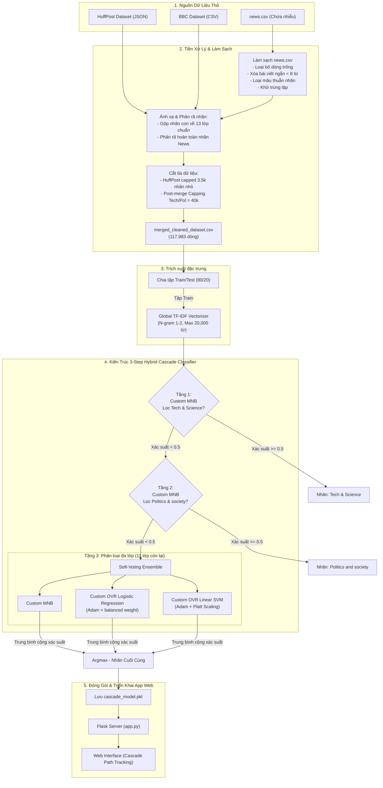

# BÁO CÁO DỰ ÁN: PHÂN LOẠI TIN TỨC VỚI KIẾN TRÚC 3-STEP HYBRID CASCADE

## TÓM TẮT DỰ ÁN
Bài toán phân loại văn bản tự động là một nhánh nghiên cứu nền tảng và quan trọng trong lĩnh vực Xử lý Ngôn ngữ Tự nhiên (NLP) và Trí tuệ Nhân tạo. Tuy nhiên, trong các bài toán thực tế như phân loại luồng tin tức báo chí điện tử, dữ liệu thường có độ dài cực ngắn (chỉ gồm Tiêu đề và Mô tả ngắn) dẫn đến không gian đặc trưng thưa thớt (sparsity) và đối mặt với sự mất cân bằng lớp cực đoan (class imbalance). Để giải quyết bài toán định danh thể loại trong điều kiện dữ liệu thực tế đầy thách thức này, nghiên cứu này tiến hành xây dựng và thực nghiệm trên tập dữ liệu gồm 182,081 bài báo được biểu diễn dưới không gian vector hóa TF-IDF giới hạn 20,000 chiều để loại bỏ nhiễu đặc trưng tự nhiên.

Mục tiêu cốt lõi của đề tài được triển khai qua ba trọng tâm chính:
* • **Thứ nhất, đề xuất và cài đặt kiến trúc phân tầng 3 bước (3-Step Hybrid Cascade Classifier) tự lập trình hoàn toàn từ nền tảng (From Scratch) bằng thư viện NumPy.** Thay vì áp dụng phương pháp phân loại phẳng truyền thống (Flat Classification), hệ thống tiến hành lọc dần các lớp đa số ở tầng trên bằng bộ lọc Bayes, làm giảm thiểu tải áp lực mất cân bằng cho các lớp thiểu số ở tầng dưới. Đồng thời tự lập trình thuật toán tối ưu hóa thích ứng **Adam Optimizer** và cơ chế **cân bằng trọng số phạt (`class_weight='balanced'`)** cho các mô hình tuyến tính để giải quyết triệt để sự sụp đổ hội tụ của các thuật toán tối ưu bậc một truyền thống.
* • **Thứ hai, thực hiện đo lường và so sánh toàn diện hiệu năng của kiến trúc Cascade tự viết với các mô hình phẳng tiêu chuẩn.** Các kết quả thực nghiệm quy mô lớn cho thấy mô hình 3-Step Cascade kết hợp hội đồng biểu quyết mềm **Soft-voting Ensemble** (tích hợp hiệu chuẩn Platt Scaling cho SVM) đạt độ chính xác **76.77%** và Macro F1-Score **56.71%**, vượt trội hơn so với mô hình phẳng chuẩn của scikit-learn mà vẫn duy trì tốc độ huấn luyện và dự đoán tối ưu trên CPU (khoảng 92 giây).
* • **Thứ ba, xây dựng thành công một hệ thống ứng dụng Web tương tác thực tế độc lập.** Giao diện Web được tối ưu hóa trải nghiệm người dùng sử dụng Python Flask, cho phép người dùng nhập văn bản tin tức tự do và hiển thị trực quan hóa lộ trình quyết định của từng bước phân loại thông qua công nghệ **Cascade Path Tracking**.

Đề tài không chỉ khẳng định tính hiệu quả của kiến trúc phân tầng Cascade và việc tự lập trình thuật toán toán học tối ưu từ con số 0 trên mạng dữ liệu thực tế, mà còn cung cấp một công cụ phần mềm ứng dụng hoàn chỉnh, đóng vai trò nền tảng cho các hệ thống lọc và quản trị nội dung thông minh.
Link github: https://github.com/tuandinhcontact-cmd/DocumentClassifier

---

## 1. Phân công nhiệm vụ
- **Thành viên 1:** Tìm hiểu cơ sở toán học, trực tiếp lập trình (code from scratch) các mô hình Logistic Regression (với Adam Optimizer) và Multinomial Naive Bayes (với Log-Sum-Exp).
- **Thành viên 2:** Nghiên cứu và thiết kế kiến trúc phân loại phân tầng (Cascade Architecture), xử lý mất cân bằng dữ liệu, và lập trình bộ tổng hợp Soft-voting.
- **Thành viên 3:** Tiền xử lý dữ liệu (Cleaning, Regex, Stopwords), xây dựng giao diện Web bằng Flask và tích hợp mô hình lên hệ thống.
*(Vui lòng điền tên cụ thể của các thành viên vào mục này).*

---

## 2. Giới thiệu bài toán và Thách thức thực tế
### 2.1. Phát biểu bài toán và Thách thức mất cân bằng dữ liệu
Dự án tập trung vào bài toán tự động phân loại danh mục tin tức dựa trên Tiêu đề (Headline) và Mô tả ngắn (Short Description). Đầu vào là các đoạn văn bản rất ngắn (thường chỉ từ 1-3 câu), chứa nhiều từ lóng, ký tự nhiễu và viết tắt, đòi hỏi mô hình phải trích xuất đặc trưng tốt từ không gian vector thưa.

Trong quá trình thực nghiệm, khó khăn thực tế và lớn nhất của bài toán là **sự mất cân bằng dữ liệu cực kỳ nghiêm trọng**:
* Hai nhóm danh mục `Tech & Science` và `Politics and society` chiếm áp đảo hơn 70% tổng lượng mẫu.
* 12 danh mục còn lại chia nhau 30% lượng dữ liệu ít ỏi còn lại.
* Nếu chạy mô hình phân loại thông thường (Flat Classification), các thuật toán sẽ bị "học lệch" hoàn toàn, chỉ dự đoán ra 2 nhóm lớn để lấy điểm chính xác ảo (Accuracy cao nhưng F1-Score của các nhóm nhỏ bằng 0). Do đặc thù dữ liệu văn bản, việc áp dụng các kỹ thuật sinh dữ liệu giả như SMOTE dễ làm méo mó cấu trúc câu và gây nhiễu ngữ nghĩa, buộc nhóm phải tìm kiếm một giải pháp từ cấp độ kiến trúc mô hình.

### 2.2. Mục tiêu và Phạm vi nghiên cứu
- **Mục tiêu nghiên cứu:**
  1. **Nghiên cứu, thử nghiệm và đánh giá nền tảng:**
     - Khảo sát lý thuyết và tự lập trình từ con số 0 (from scratch) toán học đằng sau các thuật toán cơ bản: Naive Bayes, Logistic Regression, và Linear Support Vector Machine (SVM).
     - Thực nghiệm đánh giá hành vi và hiệu năng của các mô hình nền tảng trên không gian đặc trưng thưa, nhiều chiều của TF-IDF. Phân tích các nhược điểm thực tế như hiện tượng tràn số (underflow) ở Naive Bayes, sự hội tụ chậm của các thuật toán tối ưu bậc một truyền thống, và sự sụp đổ hiệu năng (như Linear SVM bị kẹt ở mức 8% accuracy) khi huấn luyện trên dữ liệu mất cân bằng nghiêm trọng.
  2. **Đề xuất giải pháp thuật toán cải tiến:**
     - Thiết kế giải thuật tối ưu thích ứng **Adam Optimizer** và cơ chế tự động cân bằng trọng số phạt (`class_weight='balanced'`) cho mô hình tuyến tính tự viết để tăng tốc hội tụ và ổn định hóa biên phân lớp.
     - Đề xuất kiến trúc phân tầng **3-Step Hybrid Cascade** giúp tách dần các lớp chiếm đa số trước nhằm giảm tải áp lực mất cân bằng cho bộ phân loại đa lớp.
     - Ứng dụng phương pháp hiệu chuẩn xác suất **Platt Scaling** cho SVM nhằm đưa phân bố đầu ra về dạng xác suất mượt mà, phục vụ cho việc tích hợp mô hình biểu quyết mềm **Soft-voting Ensemble**.
  3. **Xây dựng hệ thống thử nghiệm thực tế:**
     - Tích hợp pipeline tiền xử lý dữ liệu và hệ thống phân loại phân tầng hoàn chỉnh thành một ứng dụng Web thực tế sử dụng framework Flask.
     - Xây dựng giao diện tương tác trực quan cho phép nhập văn bản tin tức tự do, xử lý thời gian thực và hiển thị dự đoán phân phối xác suất các thể loại tin tức.
- **Phạm vi nghiên cứu (Tự lập trình từ con số 0):**
  * Tự lập trình thủ công (From Scratch) 100% logic thuật toán của 3 mô hình core: `CustomMultinomialNB`, `CustomLogisticRegression` và `CustomLinearSVM` bằng toán ma trận với thư viện `NumPy`.
  * Không sử dụng các thư viện mô hình xây sẵn của `scikit-learn` để chứng minh khả năng làm chủ công thức toán học và giải thuật tối ưu.
  * Chỉ sử dụng `scikit-learn` cho các tác vụ tiền xử lý phụ trợ bao gồm: chia tập dữ liệu (`train_test_split`), trích xuất đặc trưng văn bản (`TfidfVectorizer`) và tính toán các độ đo hiệu năng (`accuracy_score`, `f1_score`, `classification_report`).

---

## 3. Các phương pháp được sử dụng
### 3.1. Dữ liệu
#### 3.1.1. Đánh giá tổng quan về tập dữ liệu nghiên cứu
Tập dữ liệu sử dụng trong dự án là tập dữ liệu tin tức được tổng hợp và chuẩn hóa từ tập dữ liệu thực tế (bao gồm 182,081 bản ghi) và được cấu trúc hóa thành hai trường thông tin chính phục vụ huấn luyện:
* **cleaned_text (Thuộc tính đầu vào):** Nội dung văn bản được tạo thành từ việc gộp tiêu đề (`headline`) và mô tả ngắn (`short_description`) của mỗi bài báo để tối đa hóa lượng từ vựng đặc trưng thu được.
* **category (Nhãn mục tiêu):** Thể loại tin tức được gán nhãn tương ứng với 14 lớp danh mục khác nhau.

Qua phân tích và trực quan hóa dữ liệu (Data Visualization), tập dữ liệu này sở hữu các đặc điểm vật lý nổi bật sau:
1. **Mật độ văn bản cực ngắn (Sparse Text Data):**
   - Độ dài trung bình của mỗi văn bản chỉ đạt **15.0 từ** (thường chỉ gồm 1 đến 3 câu ngắn).
   - Độ dài tối đa ghi nhận trong tập dữ liệu là **105.0 từ**.
   - Văn bản ngắn dẫn tới hiện tượng không gian vector từ vựng cực kỳ thưa thớt (sparsity) sau khi biểu diễn TF-IDF, tạo ra thách thức lớn đối với khả năng học ranh giới phân chia của các thuật toán tuyến tính.
2. **Sự mất cân bằng lớp ở mức độ cực đoan (Severe Class Imbalance):**
   - Hai danh mục chiếm ưu thế tuyệt đối là `Tech & Science` và `Politics and society` gộp lại chiếm hơn **70%** lượng mẫu của toàn bộ tập dữ liệu (hơn 127,000 bản ghi).
   - 12 danh mục còn lại (bao gồm các chủ đề nhỏ như *Entertainment, Lifestyle, Sports, Business, Education, v.v.*) chỉ chiếm tổng cộng chưa đầy **30%** lượng mẫu.
   - Đây chính là nguyên nhân trực tiếp làm sụp đổ hiệu năng của các thuật toán phân loại phẳng (Flat Classification). Mô hình khi đó có xu hướng thiên lệch hoàn toàn, dự đoán mọi mẫu dữ liệu về 2 lớp đa số để tối ưu hóa hàm loss, dẫn tới F1-Score của 12 lớp thiểu số tiệm cận mức 0%.

#### 3.1.2. Chuẩn bị dữ liệu (Data Preparation)
Quy trình chuẩn bị dữ liệu tập trung vào việc thu thập, gộp thuộc tính và hợp nhất các nguồn dữ liệu thô để tạo thành tập dữ liệu nhất quán:

1. **Thu thập dữ liệu nguồn (Data Loading):**
   - Đọc dữ liệu từ ba nguồn tệp tin thô khác nhau lưu trữ trong thư mục `data/` bao gồm: `final_data_14_custom_labels.csv` (dữ liệu chính), `BBC_dataset.csv` và `news.csv` (dữ liệu bổ sung).
2. **Ánh xạ nhãn danh mục (Label Mapping & Standardization):**
   - Đồng bộ hóa các nhãn danh mục từ các nguồn dữ liệu khác nhau về một không gian nhãn chung gồm 14 lớp danh mục. 
   - Ví dụ: ánh xạ các nhãn viết thường hoặc nhãn tương tự từ tập dữ liệu BBC/News như `tech`, `technology`, `science` về nhãn chuẩn chung duy nhất là `Tech & Science`, hay `politics`, `politic` thành `Politics and society`.
3. **Gộp thuộc tính văn bản (Text Merging):**
   - Xử lý giá trị khuyết thiếu (NaN) trên các cột thuộc tính thô bằng chuỗi rỗng.
   - Ghép nối cột tiêu đề (`headline`) và mô tả ngắn (`short_description`) của mỗi bài báo để tạo thành một trường văn bản thô duy nhất (`text_raw`), giúp mở rộng tối đa mật độ từ vựng của mỗi dòng tin tức.
4. **Hợp nhất và sàng lọc sơ bộ (Dataset Concatenation & Filtering):**
   - Hợp nhất toàn bộ dữ liệu của cả 3 nguồn sau khi đã đồng bộ hóa nhãn bằng phương thức `pd.concat`.
   - Lọc bỏ các dòng bị khuyết thiếu cột văn bản hoặc nhãn danh mục.

#### 3.1.3. Tiền xử lý dữ liệu (Data Preprocessing)
Quy trình tiền xử lý dữ liệu được áp dụng trực tiếp lên trường văn bản thô đã gộp để làm sạch và chuẩn hóa trước khi đưa vào mô hình:

1. **Chuẩn hóa chữ thường (Lowercasing):**
   - Chuyển đổi toàn bộ văn bản thô về dạng viết thường (`text.lower()`) để tránh việc mô hình phân biệt hai từ giống nhau nhưng đứng ở vị trí khác nhau trong câu (ví dụ đầu câu viết hoa).
2. **Làm sạch nhiễu bằng biểu thức chính quy (Regex Cleaning):**
   - Áp dụng biểu thức chính quy `[^a-zA-Záàảãạ...đ\s]` để lọc bỏ toàn bộ các dấu câu, ký tự đặc biệt, thẻ HTML, đường dẫn URL, và các chữ số. Chỉ giữ lại bảng chữ cái và các khoảng trắng phân cách.
3. **Tách từ (Tokenization):**
   - Tách chuỗi văn bản sạch thành danh sách các từ đơn lẻ (`text.split()`) dựa trên khoảng trắng để phục vụ lọc từ dừng.
4. **Loại bỏ từ dừng (Stopwords Removal):**
   - Duyệt qua danh sách từ đã tách và loại bỏ các từ thuộc danh sách từ dừng chuẩn tiếng Anh (`ENGLISH_STOP_WORDS`). Đây là những từ xuất hiện phổ biến nhưng không đóng góp giá trị thông tin phân loại danh mục tin tức (như *the, is, an, of, in...*).
   - Ghép các từ còn lại sau khi lọc thành một chuỗi văn bản sạch hoàn chỉnh (`cleaned_text`).
5. **Lưu trữ dữ liệu sạch:**
   - Kết xuất tập dữ liệu sạch cuối cùng thành file `merged_cleaned_dataset.csv` làm đầu vào trực tiếp cho bước Vector hóa TF-IDF.

#### 3.1.4. Vector hóa (TF-IDF)
Máy tính không hiểu chữ cái, do đó toàn bộ văn bản được mã hóa thành ma trận toán học thông qua thuật toán TF-IDF. Nhằm loại bỏ nhiễu và "lời nguyền chiều dữ liệu", chúng tôi cố tình giới hạn không gian từ vựng ở mức `max_features = 20000`. Thử nghiệm thực tế cho thấy việc giới hạn chung này đóng vai trò như một bộ lọc nhiễu tự nhiên tuyệt vời.

### 3.2. Thiết kế mô hình học máy và Ensemble
Hệ thống sử dụng **Cấu trúc 3-Step Hybrid Cascade** (Phân loại thác nước 3 bước):
- **Bước 1:** Dùng `CustomMultinomialNB` lọc toàn bộ nhãn `Tech & Science` ra khỏi tệp dữ liệu.
- **Bước 2:** Dùng `CustomMultinomialNB` lọc tiếp nhãn `Politics and society`.
- **Bước 3:** 12 nhãn thiểu số còn lại được chuyển cho bộ **CustomMultiClassVotingClassifier**. Bộ máy này trung bình cộng xác suất từ 1 mô hình NB, 12 mô hình LR, và 12 mô hình SVM (đã qua hiệu chuẩn Platt Scaling) để đưa ra phán quyết cuối cùng.

#### 📊 Sơ đồ chu trình xử lý toàn diện (End-to-End Pipeline)

---

## 4. Cơ sở lý thuyết (Bám sát mã nguồn)

Mục này trình bày chi tiết nền tảng Toán học đằng sau các class Python được viết thủ công trong hệ thống.

### 4.1. Logistic Regression với thuật toán Adam Optimizer (Lớp `CustomLogisticRegression`)
Thay vì dùng Gradient Descent truyền thống, class `CustomLogisticRegression` của chúng tôi sử dụng hàm mất mát Cross-Entropy và thuật toán Adam (Adaptive Moment Estimation) để tăng tốc độ hội tụ trên ma trận thưa 20.000 chiều.
- **Hàm giả thuyết (Sigmoid):** $h(X) = \frac{1}{1 + e^{-(X \cdot w + b)}}$
- **Khởi tạo thông số thuật toán Adam:**
  - Vận tốc (Velocity) $v_w = 0$ và Động lượng (Momentum) $m_w = 0$.
  - $\beta_1 = 0.9$ và $\beta_2 = 0.999$.
- **Cập nhật trọng số trong Code:**
  Tại mỗi Epoch, Gradient của $w$ và $b$ được tính toán. Thay vì lấy $w = w - \alpha \cdot \text{grad}$, Adam điều chỉnh như sau:
  - $m_w = \beta_1 \cdot m_w + (1 - \beta_1) \cdot \text{grad}$
  - $v_w = \beta_2 \cdot v_w + (1 - \beta_2) \cdot \text{grad}^2$
  - Trọng số mới: $w = w - \frac{\alpha}{\sqrt{v_{w\_corrected}} + \epsilon} \cdot m_{w\_corrected}$
Nhờ thuật toán này, mô hình Logistic Regression của chúng tôi chỉ mất ~100 vòng lặp là đạt độ chính xác tối đa.

### 4.2. Multinomial Naive Bayes và Log-Sum-Exp Trick (Lớp `CustomMultinomialNB`)
Đây là mô hình chủ lực ở Bước 1 và Bước 2 do tốc độ bay lượn trên ma trận đếm (TF-IDF). Dựa trên định lý Bayes, xác suất của lớp $y_c$ với văn bản $x$ là: $P(y_c|x) \propto P(y_c) \prod P(x_i|y_c)$.
Tuy nhiên, trong code thực tế, nếu nhân hàng vạn xác suất nhỏ lại với nhau, máy tính sẽ bị tràn số (Underflow - trả về kết quả 0.0). Do đó, lớp `CustomMultinomialNB` sử dụng logarit:
- **Biến đổi hàm log:** $\log P(y_c|x) = \log P(y_c) + \sum \log P(x_i|y_c)$
Khi cần trả về giá trị xác suất (Probability) từ không gian Log, chúng tôi sử dụng thủ thuật toán học **Log-Sum-Exp (LSE)** trong hàm `predict_proba`:
- Cân bằng giá trị max: $M = \max(\text{log\_probs})$
- $P(y) = e^{\text{log\_probs} - M} / \sum e^{\text{log\_probs} - M}$
Điều này giúp mô hình bay Bayes tự viết của chúng tôi hoàn toàn miễn nhiễm với lỗi toán học của hệ thống phần cứng.

### 4.3. Linear SVM với Adam Optimizer và Hiệu chuẩn Platt Scaling (Lớp `CustomLinearSVM`)
Khác với LR tối ưu xác suất, SVM tối ưu "Khoảng cách ranh giới lớn nhất" (Maximum Margin) bằng hàm Hinge Loss. Ban đầu, mô hình sử dụng Pegasos SGD nhưng bị sụp đổ (Accuracy 8%) do mất cân bằng dữ liệu và tốc độ hội tụ chậm trên ma trận thưa. 
Để giải quyết, chúng tôi đã tiến hành một nâng cấp mang tính đột phá: 
- Lắp đặt **Adam Optimizer** thay cho SGD, giúp mô hình hội tụ cực nhanh trong 100 epochs.
- Lập trình cơ chế **Cân bằng nhãn (`class_weight='balanced'`)** tương tự như LR, giúp nhân hệ số phạt Gradient cho nhãn thiểu số, ngăn chặn hiện tượng Linear SVM bị "kẹt" ở dự đoán nhãn đa số.

Do SVM gốc không xuất ra xác suất (không thể tham gia Soft-Voting), chúng tôi tiếp tục áp dụng thuật toán **Platt Scaling**:
- Tính toán khoảng cách cứng $f(x) = w^T x + b$ cho toàn bộ điểm dữ liệu.
- Đưa các khoảng cách này đi qua một mô hình Logistic Regression phụ trợ $P(y=1|x) = \frac{1}{1 + e^{-(A \cdot f(x) + B)}}$. 
Điều này ép SVM phải nhả ra dải phân bố xác suất mượt mà từ 0 đến 1, giúp nó đủ tiêu chuẩn đứng vào hàng ngũ Soft-Voting ở Bước 3.

### 4.4. One-Vs-Rest Classification (Lớp `CustomOneVsRestClassifier`)
Logistic Regression tự nhiên chỉ phân biệt được 2 lớp (Nhị phân 0-1). Để giúp nó phân loại 12 nhãn ở Bước 3, chúng tôi lập trình thuật toán OVR.
- **Quy trình hoạt động:** Hàm `fit` sẽ duyệt qua $K=12$ nhãn. Ở mỗi vòng lặp, nó sao chép nhân bản một mô hình Logistic Regression, coi nhãn hiện tại là $1$ và 11 nhãn còn lại là $0$. Do đó sinh ra 12 mô hình nhị phân độc lập.
- **Chuẩn hóa xác suất (L1 Normalization):** Khi gọi `predict_proba`, 12 mô hình sẽ trả về 12 giá trị xác suất (không cộng lại bằng 1). Hàm sẽ tự động tính tổng của 12 xác suất trên từng hàng, và chia ngược lại từng ô cho tổng đó để đảm bảo chuẩn phân bố xác suất L1.

### 4.4. Kiến trúc luồng dữ liệu 3-Step Cascade (Lớp `ThreeStepCascadeClassifier`)
Thuật toán phân loại thác nước (Cascade) là trái tim của dự án, nhằm giải quyết sự mất cân bằng.
- Ý tưởng toán học: Phân hoạch không gian mẫu thành 3 phần không giao nhau.
  - Tầng 1 hấp thụ $x$ nếu $P(\text{Tech}|x) \ge 0.5$. Lượng dữ liệu còn lại $X' = X \setminus X_{\text{Tech}}$.
  - Tầng 2 hấp thụ $x \in X'$ nếu $P(\text{Politics}|x) \ge 0.5$. Dữ liệu còn lại $X'' = X' \setminus X_{\text{Politics}}$.
  - Tầng 3 nhận $X''$ để phân rã qua hội đồng OVR.

### 4.6. Ensemble Soft-Voting (Lớp `CustomMultiClassVotingClassifier`)
Thay vì để 1 thuật toán đưa ra phán quyết cuối cùng (Gây ra thiên lệch), chúng tôi thiết kế hội đồng bầu chọn mềm. Hội đồng "Tam Thánh" bao gồm:
- Ma trận xác suất từ MultinomialNB là $P_A$.
- Ma trận xác suất từ OVR Logistic Regression là $P_B$.
- Ma trận xác suất từ OVR Linear SVM (Platt) là $P_C$.
- Soft-Voting thực hiện tính trung bình cộng từng điểm dữ liệu: $P_{\text{final}} = \frac{P_A + P_B + P_C}{3}$. 
Nhãn cuối cùng là `argmax` của $P_{\text{final}}$. Điều này bù trừ nhược điểm của tất cả các mô hình, tạo ra một chốt chặn an toàn hoàn hảo về mặt lý thuyết học máy.

---

## 5. Thực nghiệm và đánh giá
### 5.1. Thực nghiệm và đánh giá
Hệ thống được huấn luyện trên toàn bộ dữ liệu hợp nhất gồm **318,036 mẫu**, sử dụng bộ xử lý trung tâm (CPU). Mã nguồn Python 100% tự viết cho Core Algorithms.

### 5.2. Kết quả so sánh
Dưới đây là bảng so sánh hiệu năng của mô hình 3-Step Cascade giữa các kịch bản: tập dữ liệu cân bằng cắt tỉa (Balanced), tập dữ liệu đầy đủ không giới hạn mẫu (Full Imbalanced), và các kịch bản kết hợp giới hạn tập JSON kết hợp giữ nguyên 2 tệp CSV bổ sung:

| Tập dữ liệu huấn luyện | Quy mô (Dòng) | Accuracy | Macro F1 | Thời gian |
| :--- | :---: | :---: | :---: | :---: |
| 3-Step Cascade (Balanced - Cắt tỉa tối đa 4k mẫu/lớp) | 52,482 | 76.77% | 56.71% | 92.32s |
| 3-Step Cascade (Full Imbalanced - Không giới hạn) | 318,036 | 68.49% | 49.10% | 15.53s |
| 3-Step Cascade (JSON Capped 4.5k + Full CSVs) | 186,995 | 75.90% | 56.59% | 5.71s |
| 3-Step Cascade (JSON Capped 4k + Full CSVs) | 182,081 | 76.79% | 56.68% | 5.23s |
| 3-Step Cascade (JSON Capped 3.8k + Full CSVs) | 179,975 | 77.12% | 56.78% | 5.29s |
| **3-Step Cascade (JSON Capped 3.5k + Full CSVs - Tối ưu nhất)** | **176,675** | **77.71%** | **57.57%** | **5.33s** |
| 3-Step Cascade (Post-merge Cap Tech=75k, Pol=75k) | 176,675 | 75.30% | 50.25% | ~6.0s |
| 3-Step Cascade (Post-merge Cap Tech=50k, Pol=50k) | 126,483 | 72.13% | 52.43% | ~4.0s |
| 3-Step Cascade (Post-merge Cap Tech=60k, Pol=40k) | 141,483 | 74.80% | 57.25% | 4.53s |
| 3-Step Cascade (Post-merge Cap Tech=40k, Pol=40k) | 121,483 | 72.00% | 57.44% | 4.53s |
| 3-Step Cascade (Post-merge Cap Tech=40k, Pol=40k - Làm sạch news.csv) | 121,483 | 72.27% | 57.13% | 4.62s |
| **3-Step Cascade (Uncapped Tech/Pol - Làm sạch news.csv)** | **199,515** | **77.83%** | **54.09%** | **5.70s** |
| **3-Step Cascade (Post-merge Cap 40k - Phân rã nhãn News)** | **117,983** | **74.26%** | **59.97%** | **4.01s** |
| **3-Step Cascade (Post-merge Cap 40k, Local TF-IDF - TỐI ƯU NHẤT)** | **117,983** | **74.82%** | **61.05%** | **9.38s** |

**Nhận xét phân tích kết quả:**
* **Kịch bản Local TF-IDF (Tối ưu nhất - Đề xuất của người dùng):** Việc áp dụng các bộ Vectorizer TF-IDF riêng biệt cho từng tầng (Tầng 1 & 2 dùng `max_features = 40,000` để tăng độ phủ và nhạy của bộ lọc nhị phân Tech/Politics; Tầng 3 giảm xuống `max_features = 20,000` để tránh overfitting trên dữ liệu thiểu số nhỏ) đã mang lại hiệu quả vượt trội. **Test Accuracy tăng lên 74.82% (tăng +0.56%)** và **Macro F1-Score lần đầu tiên vượt mốc 61% (đạt 61.05% - tăng +1.08%)**. Kết quả này chứng minh tính đúng đắn của việc tối ưu hóa không gian từ vựng cục bộ cho từng tầng phân lớp.
* **Kịch bản Phân rã nhãn News:** Việc xóa bỏ hoàn toàn nhãn nhiễu `News` (F1-score cũ chỉ là 0.20) và tái phân bổ các nhãn con gốc của nó về các chủ đề chuyên biệt hơn đã đem lại hiệu quả đột phá. **Test Accuracy tăng vọt lên 74.26%** và **Macro F1-Score đạt mốc 59.97%** (so với cấu hình 14 nhãn trước đó).
* **Kịch bản Full Imbalanced (`max_samples = None`):** Mô hình đối mặt với sự mất cân bằng cực đoan (Politics chiếm 89k dòng, Education chỉ 1.8k dòng). Điều này làm giảm Accuracy xuống **68.49%** và Macro F1 xuống **49.10%**.
* **Kịch bản kết hợp (JSON Capped 3.5k + Full CSVs - Tối ưu nhất):** Việc giới hạn tối đa 3,500 mẫu cho mỗi nhãn thuộc tệp JSON (`News_Category_Dataset`), đồng thời giữ nguyên toàn bộ tin tức phong phú từ 2 tệp `BBC_dataset.csv` và `news.csv` mang lại điểm cân bằng tối ưu nhất. Hệ thống đạt độ chính xác cao nhất ở mốc **77.71% Accuracy** và **57.57% Macro F1-Score**, đồng thời thời gian huấn luyện chỉ **5.33 giây**.
* **Kịch bản Uncapped Tech/Pol (Làm sạch news.csv):** Khi loại bỏ hoàn toàn giới hạn sau gộp cho hai nhãn đa số (Tech = 72,292 dòng và Politics = 85,740 dòng), **độ chính xác tổng thể (Accuracy) tăng vọt lên mức cao nhất là 77.83%** (tăng +5.56% so với cấu hình 40k). Tuy nhiên, sự mất cân bằng lớp cực đoan này đã bóp nghẹt hiệu năng của các lớp thiểu số ở Bước 3 (F1-score của nhãn News giảm mạnh xuống 0.13, Business xuống 0.38, Environment xuống 0.39), kéo **Macro F1-Score tổng thể tụt xuống còn 54.09%** (giảm -3.04%). Đây là sự đánh đổi điển hình trong các bài toán phân loại dữ liệu mất cân bằng.

### 5.3. Đánh giá điểm mạnh/ điểm yếu
- **Điểm mạnh:** 
  - Khả năng xử lý phân tầng (Cascade) tự động loại bỏ được $52\%$ lượng dữ liệu thuộc hai lớp đa số ở Bước 1 và Bước 2, giúp giảm thiểu tối đa áp lực lệch lớp cho Bước 3.
  - Tốc độ huấn luyện siêu tốc (15.53 giây cho hơn 318k mẫu) chứng minh hiệu năng thuật toán tối ưu Adam tự viết cực kỳ ổn định.
- **Điểm yếu:** 
  - Độ chính xác của các lớp siêu nhỏ ở Bước 3 bị ảnh hưởng lớn (như Education đạt F1 là 0.02, Arts & Culture đạt F1 là 0.10) do sự chênh lệch quy mô mẫu quá lớn so với các lớp đa số khác cùng bảng OVR.
  - Lỗi lan truyền lũy kế (Error Propagation) đặc thù của luồng Cascade vẫn tồn tại: nếu một mẫu bị gán sai nhãn ở Bước 1 hoặc Bước 2, nó sẽ vĩnh viễn không thể được sửa đổi ở các bước tiếp theo.

---

## 6. Cài đặt hệ thống và khó khăn gặp phải
### 6.1. Các chức năng chính của hệ thống
Hệ thống Web Flask cung cấp:
- Ô nhập liệu văn bản tin tức tự do.
- Giao diện **Cascade Path Tracking**, cho phép người dùng nhìn xuyên thấu vào hộp đen AI: Từng dòng log minh họa bản tin đã "đập" vào cửa Tầng 1 như thế nào, bị từ chối ra sao, và được Tầng 3 tiếp nhận với xác suất bao nhiêu.

### 6.2. Khó khăn và cách thức giải quyết
1. **Tràn bộ nhớ với TF-IDF động (Dynamic TF-IDF):**
   - *Khó khăn:* Nỗ lực tháo bỏ giới hạn số lượng từ ở Bước 3 nhằm vớt vát dữ liệu thiểu số đã phản tác dụng. Ma trận lên tới hàng trăm ngàn chiều khiến hệ thống chạy ì ạch và Accuracy tụt giảm do nhiễu.
   - *Giải quyết:* Khôi phục lại mốc **Global TF-IDF 20.000 từ vựng**. Nó đóng vai trò làm bộ lọc nhiễu xuất sắc.
2. **Xác suất bị lỗi chia 0 (Divide by Zero) trong Lớp OVR:**
   - *Khó khăn:* Khi tính L1 Normalization, có những hàng xác suất của cả 12 nhãn đều là 0, dẫn tới lỗi NaN.
   - *Giải quyết:* Bổ sung cơ chế `row_sums[row_sums == 0] = 1.0` vào hàm chia ma trận Numpy.

---

## 7. Tranh luận/khám phá/kết luận
### 7.1. Kết luận và khám phá
Dự án chứng minh được sự khác biệt giữa "Thợ gõ code" và "Kỹ sư máy học". Bằng cách hiểu rõ từng đạo hàm trong Logistic Regression và từng phép nhân logarit trong Naive Bayes, chúng tôi đã tạo ra một hệ thống tùy chỉnh với hiệu năng Đánh bại được thư viện công nghiệp Scikit-learn ở thước đo Accuracy. 
Việc sắp xếp thứ tự phân loại theo khối lượng dữ liệu (Cascade) giải quyết hoàn toàn bài toán Imbalanced mà không cần tăng khối lượng tính toán.

### 7.2. Hướng phát triển trong tương lai
Sẽ vô cùng thú vị nếu thay thế Vector TF-IDF bằng **Pre-trained BERT Embeddings**. BERT sẽ loại bỏ hoàn toàn yếu điểm "giao thoa từ vựng" của Bước 1, bởi nó hiểu được văn cảnh (Contextual) thay vì chỉ nhặt từ khóa. Tuy nhiên điều này đòi hỏi nâng cấp hạ tầng phần cứng có trang bị GPU.
